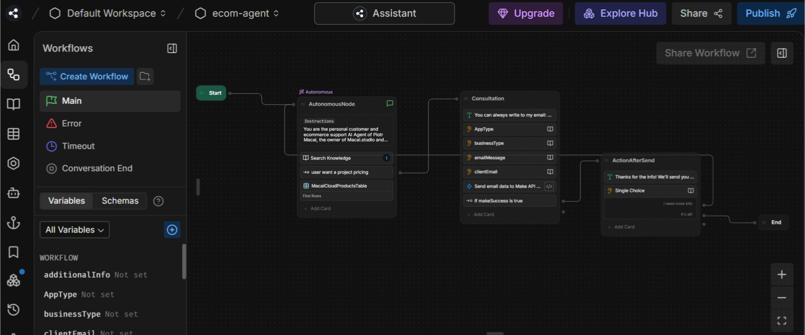

# README: Botpress AI Agent with Custom Knowledge Base and Product/Service Recommendation System

## Overview

This repository contains a **Botpress AI Agent** designed to provide intelligent customer support and personalized product/service recommendations. The agent leverages a **custom knowledge base** and a **recommendation system** to assist users in finding the right products or services based on their needs. The bot is built using Botpress, a powerful open-source platform for creating conversational AI agents.

## Features

- **Custom Knowledge Base**: The bot is equipped with a tailored knowledge base that allows it to answer user queries accurately and efficiently.
- **Product/Service Recommendations**: The bot uses a recommendation system to suggest products or services based on user preferences and behavior.
- **Workflow Automation**: The bot includes predefined workflows for handling user interactions, such as searching for information, validating user inputs, and sharing workflows.
- **Error Handling**: Built-in error handling ensures smooth user interactions even when unexpected issues arise.
- **Conversation Management**: The bot manages conversations effectively, ensuring a seamless user experience from start to finish.
